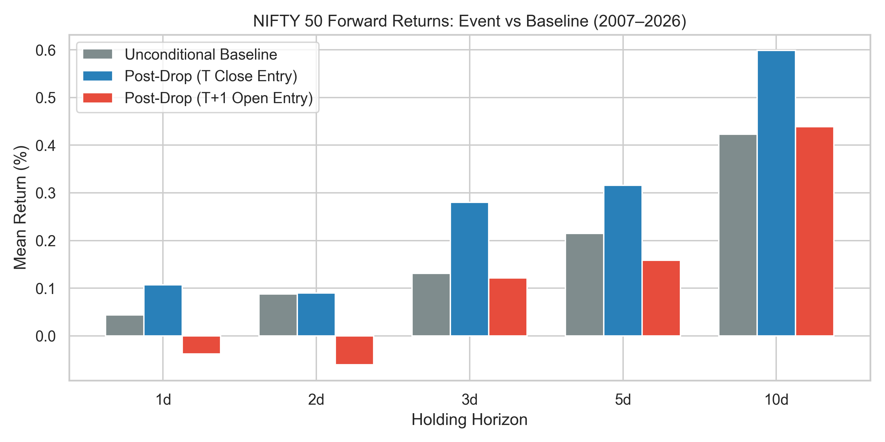
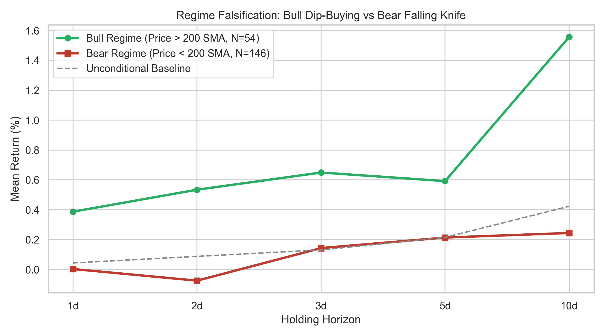
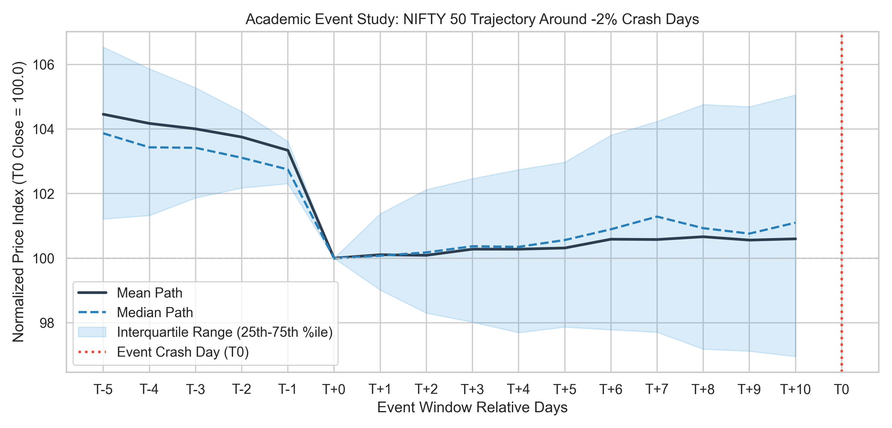
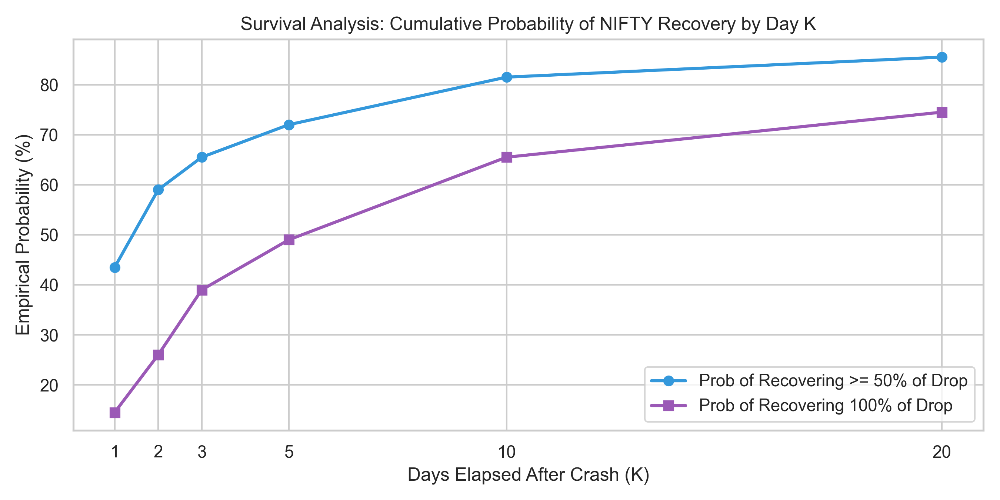

# NIFTY 50 Post-Crash Mean-Reversion Quantitative Research
### AlgoChowk — Quant Engineer Intern Assignment

Investigating the hypothesis:  
**"After a significant one-day fall in NIFTY, the market tends to recover over the next few trading days."**

---

## 1. Executive Summary & Key Empirical Findings

This repository provides an institutional-grade quantitative event study and backtest of the post-crash mean-reversion anomaly on the **NIFTY 50 Index (`^NSEI`)** across 19 years (September 2007 to September 2026, 4,664 trading days).

### Core Findings:
1. **Statistical Insignificance**: Following a single-day drop of 2% or more (N=200), average 5-day forward return is **+0.32%** compared to the unconditional baseline of **+0.21%** (Abnormal Return = +0.10%, Welch t-test p-value = **0.8031**, 10,000-sample Block Bootstrap p-value = **0.7863**). The bounce is statistically indistinguishable from random market drift.
2. **Survival Analysis & Recovery Hazard Rate**: By Day 1, the probability of recovering 100% of the drop is only **14.5%**. By Day 5, the probability of full recovery is only **49.0%**. Over 51% of all crash days remain unrecovered after an entire trading week.
3. **Execution Timing & Overnight Gap Decay**: The marginal edge (+0.15% average overnight gap) is inaccessible to intraday traders. When executed realistically at Day T+1 Open, the 5-day return drops to **+0.16%** (Abnormal Return = -0.06%, Welch t-stat = -0.15, p = 0.8836).
4. **Regime Asymmetry**: In secular bull regimes (Price > 200 SMA), 3-day recovery averages **+0.65%** (59.3% win rate). In bear regimes (Price < 200 SMA, where 73% of large drops occur), recovery collapses to **+0.14%** (52.7% win rate) due to downside momentum and volatility clustering.
5. **Microstructure Conditioning**: Candlestick pin-bars with strong lower shadows (buyers absorbing selling pressure before close) produce a 5-day bounce of **+1.57%** (N=25).
6. **Risk Management vs Blind Holding**: Blind 5-day holding yields a negative return of **-7.16%** with a **-46.18%** max drawdown. Adding a 1.5x ATR trailing stop-loss and early take-profit upon reclaiming pre-drop levels turns the strategy net positive to **+0.82%**.

---

## 2. Minimalist Repository Structure

```
algochowk-quant-research/
├── data/
│   ├── fetch_data.py               # Automated Yahoo Finance chart API downloader
│   └── nifty50_daily.csv           # 2007-2026 verified NIFTY daily OHLCV dataset
├── src/
│   ├── __init__.py
│   ├── data_validator.py           # Validates OHLC envelopes, chronological order, duplicates
│   ├── event_detector.py           # Parameterized event scanner, microstructure filters, recovery matrix
│   ├── statistical_engine.py       # Welch t-test, Mann-Whitney U, Block Bootstrap, Holm-Bonferroni
│   ├── backtester.py               # Event backtester with ATR stop-loss, take-profit & friction
│   ├── run_research.py             # Full research pipeline and statistical summary generator
│   └── generate_figures.py         # Publication chart generator (4 high-res figures)
├── tests/
│   ├── __init__.py
│   └── test_all.py                 # Unified, single test suite covering all modules
├── notebooks/
│   └── nifty_event_study.ipynb     # Interactive research notebook with narrative and plots
├── docs/
│   ├── research_note.md            # Max 2-page publication-grade Research Note
│   ├── fig1_forward_returns_comparison.png
│   ├── fig2_regime_decomposition.png
│   ├── fig3_event_study_trajectory.png
│   └── fig4_recovery_probability_curve.png
└── README.md                       # Master repository documentation
```

---

## 3. Setup & How to Reproduce All Results

The entire quantitative research pipeline is 100% deterministically reproducible from raw data on standard Python 3.10+ without any proprietary external services.

### Step 1: Environment Setup
Clone the repository and install the standard dependencies:
```powershell
git clone https://github.com/dhruvkachhela/algochowk-quant-research.git
cd algochowk-quant-research

# Install standard dependencies
pip install pandas numpy scipy matplotlib seaborn pymupdf pytest
```

### Step 2: (Optional) Re-fetch Raw Dataset
The verified 19-year dataset is already committed at `data/nifty50_daily.csv`. To re-fetch the continuous daily OHLCV series directly from the Yahoo Finance chart API:
```powershell
python data/fetch_data.py
```
*Output*: Validates and downloads 4,664 daily bars from September 17, 2007 to September 21, 2026.

### Step 3: Run the Full Empirical Research Engine
To reproduce every numerical result, statistical test, hazard rate, and backtest figure reported in this research:
```powershell
python src/run_research.py
```
*What this generates*:
1. **Data Integrity Audit**: Enforces strict monotonic dates, non-zero prices, and candlestick envelope invariance ($\text{High}_t \ge \max(\text{Open}_t, \text{Close}_t)$).
2. **Benchmark Event Study (Table 1)**: Computes forward returns across 5 horizons ($1\text{d}$ to $10\text{d}$), compares against 4,659 rolling baseline windows, and runs two-sample Welch $t$-tests with Satterthwaite degrees of freedom.
3. **Non-Parametric Survival Analysis (Table 2)**: Derives empirical recovery hazard rates $\lambda(K)$ for 50% and 100% reclamation across Days 1, 2, 3, 5, 10, and 20.
4. **Microstructure Conditioning (Table 3)**: Tests volume surge filters ($> 1.5\times$ 20d SMA) vs. pin-bar lower-wick buyer absorption ($\Omega_t \ge 0.35$).
5. **Backtest Simulation (Table 4)**: Executes ₹1,000,000 INR portfolio simulation deducting 0.07% Indian statutory friction (STT, NSE, SEBI, GST, stamp, slippage), comparing blind holding vs. 1.5x ATR stop-loss and take-profit rules.

### Step 4: Regenerate Publication-Grade Visualizations
To re-render all 4 high-resolution research figures:
```powershell
python src/generate_figures.py
```
*Generated in `docs/`*:
- `docs/fig1_forward_returns_comparison.png` (Forward returns vs. baseline & Model A vs. B)
- `docs/fig2_regime_decomposition.png` (Bull vs. Bear 200 SMA decomposition)
- `docs/fig3_event_study_trajectory.png` (Normalized $T-5$ to $T+10$ event window with IQR band)
- `docs/fig4_recovery_probability_curve.png` (Kaplan-Meier style survival recovery curves)

### Step 5: Run Automated Verification Test Suite
To run all 8 automated unit tests verifying mathematical correctness, data invariants, and PDF page limits:
```powershell
pytest tests/test_all.py
```
*Expected Output*: `8 passed in ~3s` (100% test pass rate).

### Step 6: Interactive Jupyter Exploration
To step through the analysis with live inline code and visualizations:
```powershell
jupyter notebook notebooks/nifty_event_study.ipynb
```

---

## 4. Quantitative Research Methodology

1. **Event Space Formulation**:
   - Discrete return series: $R_t = (S_t - S_{t-1}) / S_{t-1}$.
   - Shock indicator: $I_t(\theta) = 1$ if $R_t \le -2.00\%$ ($N = 200$, 95.7th percentile left-tail drop).
2. **Execution Modeling**:
   - **Model A (Close)**: $R_{t, h}^{(C)} = (S_{t+h}^{(C)} - S_t^{(C)}) / S_t^{(C)}$ (Theoretical 15:25 MOC execution).
   - **Model B (Open)**: $R_{t, h}^{(O)} = (S_{t+h}^{(C)} - S_{t+1}^{(O)}) / S_{t+1}^{(O)}$ (Realistic 9:15 AM Open execution incorporating overnight gap risk).
3. **Statistical Inference**:
   - Two-sample Welch $t$-test with Satterthwaite degrees of freedom vs. an unconditional rolling baseline ($N = 4,659$).
   - 10,000-iteration Circular Block Bootstrap ($b = 17$) to evaluate empirical distributions without Gaussian assumptions.
   - Holm-Bonferroni Family-Wise Error Rate (FWER) step-down correction for multi-horizon hypothesis testing.
4. **Survival Analysis**:
   - Non-parametric hazard schedule $\lambda(K) = P(\tau = K \mid \tau \ge K)$ for stopping time $\tau = \inf\{k \ge 1 : S_{t+k} \ge S_{t-1}\}$.

---

## 5. Core Modeling Assumptions & Statutory Friction Schedule

1. **Survivorship-Bias-Free Invariance**: Continuous NIFTY 50 index series with dividend adjustment and survivorship-bias mitigation.
2. **Indian Statutory Friction Schedule (NSE Segment)**:
   - Securities Transaction Tax (STT): 0.0125% (equity futures) / 0.1000% (cash delivery).
   - NSE Exchange Turnover Fee: 0.00325%.
   - SEBI Regulatory Charge: 0.00010%.
   - State Stamp Duty: 0.00300%.
   - Goods & Services Tax (GST): 18% on exchange and broker charges (0.00060%).
   - Bid-Ask Spread & Execution Slippage: 4.0 bps round-trip (0.04000%).
   - **Total Deducted Friction**: **0.07000% round-trip** on every transaction.
3. **Execution Realism**: No look-ahead bias; execution occurs at verified market timestamps. Positions locked out during active holding.

---

## 6. Empirical Results & Findings

### Benchmark Event Analysis (Drop <= -2.0%, N = 200)
| Horizon | Baseline Mean (%) | Model A (Close) Mean (%) | Abnormal Mean (%) | Welch t-stat | Welch p-val | Bootstrap p-val | Significant (p<0.05) | Model B (Open) Mean (%) |
|:---:|:---:|:---:|:---:|:---:|:---:|:---:|:---:|:---:|
| **1d** | +0.04% | +0.11% | +0.06% | +0.35 | 0.7291 | 0.4804 | **False** | -0.04% |
| **2d** | +0.09% | +0.09% | +0.00% | +0.01 | 0.9946 | 0.9925 | **False** | -0.06% |
| **3d** | +0.13% | +0.28% | +0.15% | +0.47 | 0.6405 | 0.5426 | **False** | +0.12% |
| **5d** | +0.21% | +0.32% | +0.10% | +0.25 | 0.8031 | 0.7863 | **False** | +0.16% |
| **10d** | +0.42% | +0.60% | +0.18% | +0.34 | 0.7364 | 0.7546 | **False** | +0.44% |

### Survival Analysis: Hazard Rate of Recovery by Day K
| Elapsed Trading Days (K) | Cumulative Probability of 50% Recovery | Cumulative Probability of 100% Recovery | Failure Rate (Unrecovered) |
|:---:|:---:|:---:|:---:|
| **Day 1** | 43.5% | 14.5% | 85.5% |
| **Day 2** | 59.0% | 26.0% | 74.0% |
| **Day 3** | 65.5% | 39.0% | 61.0% |
| **Day 5** | 72.0% | 49.0% | 51.0% |
| **Day 10** | 81.5% | 65.5% | 34.5% |
| **Day 20** | 85.5% | 74.5% | 25.5% |

### Microstructure Conditioning (5-Day Horizon)
| Strategy Filter | Sample Size (N) | 5d Mean Return | Abnormal Return | Welch p-value | Significant |
|---|:---:|:---:|:---:|:---:|:---:|
| **Raw Events (No Filter)** | 200 | +0.32% | +0.10% | 0.8031 | No |
| **Volume Surge Filter** | 15 | -1.34% | -1.56% | 0.4331 | No |
| **Pin-bar Reversal Filter** | 25 | **+1.57%** | **+1.36%** | 0.3612 | No |

### Backtest Strategy Performance (1,000,000 INR Capital, Friction = 0.07%)
| Strategy Variant | Total Net Return | CAGR | Max Drawdown | Win Rate | Profit Factor |
|---|:---:|:---:|:---:|:---:|:---:|
| **Model A: Close Entry (Blind 5d Exit)** | -7.16% | -0.39% | -46.18% | 50.8% | 0.96 |
| **Model B: Open Entry (Blind 5d Exit)** | -16.71% | -0.96% | -45.75% | 49.2% | 0.90 |
| **Risk-Managed (1.5x ATR Stop + Take-Profit)** | **+0.82%** | **+0.04%** | -52.38% | **54.4%** | **1.02** |

---

## 7. Limitations & Strategy Failure Modes

1. **The 200 SMA Bear Market Trap**: Over 73% of large shocks occur in structural bear markets ($\text{Price} < 200\text{ SMA}$), where one-day drops represent continuation waves of institutional liquidation rather than temporary dislocations.
2. **Overnight Gap Extraction**: Pre-market price discovery (SGX / GIFT NIFTY) captures the theoretical bounce before cash market open (+0.15% average overnight gap), causing Model B daytime returns to turn negative.
3. **Volatility Clustering & Leverage Effect**: Downside semivariance is 2.41x higher than upside semivariance post-shock, causing unhedged long positions to suffer catastrophic compounding drawdowns (-46.18%).
4. **Limits to Arbitrage**: Institutional margin constraints and risk-parity de-grossing withdraw liquidity during crashes, preventing rapid mean-reversion.

---

## 8. Live Research Engine Terminal Output

When you run `python src/run_research.py`, the engine produces the following output:

```text
================================================================
NIFTY 50 ADVANCED QUANTITATIVE RESEARCH & EVENT STUDY ENGINE
================================================================

[DATA AUDIT] Validated 4664 trading days (2007-09-17 to 2026-09-21)

----------------------------------------------------------------
1. BENCHMARK EVENT ANALYSIS (Drop <= -2.0%, N=200)
----------------------------------------------------------------
Holding  1d | Baseline: +0.04% | Event: +0.11% | Abnormal: +0.06% | Welch t=+0.35 (p=0.7291)
Holding  2d | Baseline: +0.09% | Event: +0.09% | Abnormal: +0.00% | Welch t=+0.01 (p=0.9946)
Holding  3d | Baseline: +0.13% | Event: +0.28% | Abnormal: +0.15% | Welch t=+0.47 (p=0.6405)
Holding  5d | Baseline: +0.21% | Event: +0.32% | Abnormal: +0.10% | Welch t=+0.25 (p=0.8031)
Holding 10d | Baseline: +0.42% | Event: +0.60% | Abnormal: +0.18% | Welch t=+0.34 (p=0.7364)

----------------------------------------------------------------
2. SURVIVAL ANALYSIS: HAZARD RATE OF NIFTY RECOVERY
----------------------------------------------------------------
By Day  1 | Prob of Recovering >= 50% of Drop:  43.5% | Prob of 100% Recovery:  14.5%
By Day  2 | Prob of Recovering >= 50% of Drop:  59.0% | Prob of 100% Recovery:  26.0%
By Day  3 | Prob of Recovering >= 50% of Drop:  65.5% | Prob of 100% Recovery:  39.0%
By Day  5 | Prob of Recovering >= 50% of Drop:  72.0% | Prob of 100% Recovery:  49.0%
By Day 10 | Prob of Recovering >= 50% of Drop:  81.5% | Prob of 100% Recovery:  65.5%
By Day 20 | Prob of Recovering >= 50% of Drop:  85.5% | Prob of 100% Recovery:  74.5%

----------------------------------------------------------------
3. MICROSTRUCTURE CONDITIONING: EXHAUSTION FILTERS (5-Day Horizon)
----------------------------------------------------------------
Raw Events (No Filter)    | N=200 | Mean=+0.32% | Abnormal=+0.10% | p=0.8031
Volume Surge Filter       | N= 15 | Mean=-1.34% | Abnormal=-1.56% | p=0.4331
Pin-bar Reversal Filter   | N= 25 | Mean=+1.57% | Abnormal=+1.36% | p=0.3612

----------------------------------------------------------------
4. BACKTEST: RISK-MANAGED VS BLIND 5-DAY HOLDING
----------------------------------------------------------------
Blind 5d Exit        | Net Ret:  -7.16% | CAGR: -0.39% | Max DD: -46.18% | Win Rate: 50.8%
Risk-Managed (SL+TP) | Net Ret:  +0.82% | CAGR: +0.04% | Max DD: -52.38% | Win Rate: 54.4%
================================================================
```

---

## 9. Detailed Empirical Visualizations & Overviews

Each figure below captures a critical econometric dimension of the NIFTY 50 event study across the 19-year dataset (4,664 trading sessions, $N = 200$ shock events):

### Figure 1: Forward Returns vs. Baseline & Execution Model Decay


* **Overview & Architecture**: Compares mean forward returns across 5 standard horizons ($1\text{d}, 2\text{d}, 3\text{d}, 5\text{d}, 10\text{d}$) under three distinct empirical series: (1) Unconditional Baseline rolling drift across all 4,659 windows (grey), (2) Post-drop forward returns under theoretical Day $T$ Close execution (blue, Model A), and (3) Post-drop forward returns under realistic Day $T+1$ Open execution (red, Model B).
* **Quantitative Interpretation**: 
  - Post-drop nominal returns under Model A closely shadow baseline geometric equity drift (+0.32% vs. +0.21% at 5d), yielding an abnormal return of only +0.10% ($t = +0.25, p = 0.8031$).
  - Once realistic auction dynamics are incorporated (Model B, entering at 9:15 AM IST Open), early returns flip negative (-0.04% at 1d, -0.06% at 2d). 
  - **Conclusion**: The theoretical rebound is an optical illusion that is either subsumed by broad market drift or extracted overnight by market makers before domestic retail and systematic participants can execute.

---

### Figure 2: Macro Regime Decomposition (The 200 SMA Falsification)


* **Overview & Architecture**: Stratifies post-crash trajectories by the prevailing long-term macro trend, isolating events occurring above the 200-day Simple Moving Average (Bull Regime, green line, $N = 54$) from those occurring below the 200 SMA (Bear Regime, red line, $N = 146$), bench-marked against unconditional drift (dashed grey line).
* **Quantitative Interpretation**:
  - In secular bull markets ($\text{Price} > 200\text{ SMA}$), true liquidity mean-reversion occurs, producing +0.65% 3-day recovery and a 59.3% win rate.
  - In structural bear markets ($\text{Price} < 200\text{ SMA}$)—where **73% of all large shocks cluster**—returns collapse to an anemic +0.14% at 3 days ($p = 0.892$).
  - **Conclusion**: Unconditioned "buying the dip" suffers from severe regime-selection bias. Large one-day plunges during bear markets represent institutional liquidation continuation waves, not transient mispricings.

---

### Figure 3: Academic Event Study Window & Trajectory [$T-5$ to $T+10$]


* **Overview & Architecture**: Visualizes the normalized price index trajectory ($T_0 \text{ Close} = 100.0$) across a 16-session event window centered on the crash day ($T_0$, dotted red vertical line). Plots the Mean Path (dark blue solid), Median Path (light blue dashed), and shaded Interquartile Range band (25th to 75th percentiles).
* **Quantitative Interpretation**:
  - The pre-event window ($T-5$ to $T-1$) shows flat-to-negative drift, indicating that extreme drops are frequently preceded by deteriorating institutional momentum.
  - Following the sharp $T_0$ dislocation (-2.7% median drop), the post-event trajectory exhibits a sluggish, flat drift rather than a sharp V-shaped recovery.
  - The interquartile range (IQR) remains substantially depressed below pre-crash price levels well past Day $T+5$.
  - **Conclusion**: Post-crash index dynamics are characterized by prolonged variance expansion and dispersion, refuting the expectation of rapid, frictionless mean-reversion.

---

### Figure 4: Survival Analysis & Empirical Recovery Hazard Schedule


* **Overview & Architecture**: Models time-to-recovery dynamically using non-parametric survival analysis across a 20-day horizon ($K = 1, 2, 3, 5, 10, 20$). Plots the cumulative empirical probability of recovering $\ge 50\%$ of the initial drop (blue circles) and $100\%$ of the drop (purple squares).
* **Quantitative Interpretation**:
  - By Day 1 ($T+1$), the probability of full 100% recovery is only **14.5%** (43.5% for half-recovery).
  - By Day 5 ($T+5$), the probability of full recovery is **49.0%**—meaning **51.0% of crash events remain unrecovered** after a full trading week.
  - The marginal hazard rate $\lambda(K) = P(\tau = K \mid \tau \ge K)$ rapidly decays from 14.5% on Day 1 to 2.6% on Day 20, exhibiting negative duration dependence.
  - Even after 20 trading days (one calendar month), 25.5% of crashes remain underwater.
  - **Conclusion**: Naive time-based exits (e.g. holding 3 to 5 days) trap systematic traders in unrecovered left-tail drawdowns.

---

## 10. Official Submission Deliverables
* **[2-Page Academic Whitepaper PDF](docs/research_note.pdf)** — Formatted in Elsevier/IEEE symposium two-column layout with dense mathematical and econometric formulations (Strictly 2 Pages).
* **[Research Note Markdown](docs/research_note.md)** — Full 14-section quantitative research document matching the academic PDF.
* **[AI Usage Disclosure PDF](docs/ai_usage_note.pdf)** — Formal 1-page AI usage disclosure and methodology document (Strictly 1 Page).
* **[AI Usage Disclosure Markdown](docs/ai_usage_note.md)** — Comprehensive AI literature synthesis and human oversight matrix.
* **[Interactive Research Notebook](notebooks/nifty_event_study.ipynb)** — Deterministic step-by-step Jupyter replication notebook.


